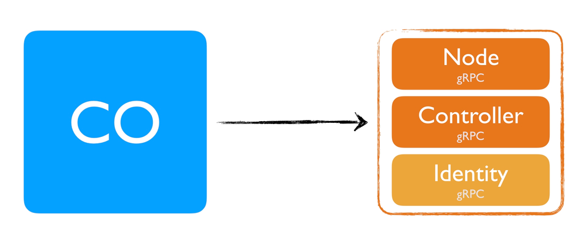
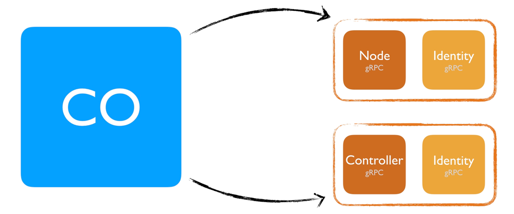

## CSI driver Writing Guide
- https://arslan.io/2018/06/21/how-to-write-a-container-storage-interface-csi-plugin/
- https://github.com/container-storage-interface/spec/blob/v0.2.0/spec.md?ref=arslan.io
- https://stripe.com/blog/idempotency?ref=arslan.io

### Overview

The specification defines the boundary between the CO and the CSI plugin. Before we continue, note that the plugin part actually is separated into two individual plugins.
- **Node Plugin:** The `Node plugin` is a `gRPC server` that needs to run on the Node where the volume will be provisioned. So suppose you have a Kubernetes cluster with  three nodes where your Pod's are scheduled, you would deploy this to all three nodes.
- **Controller Plugin:** The `Controller plugin` is a `gRPC server` that can run anywhere. In terms of a Kubernetes cluster, it can run on any node (even on the master node). 


These two entities can live in a single binary or you can separate them. That's up to you. But more on this later.



Identity Service: Finally, there is also the `Identity gRPC server`, which we’ll see in a bit. This service needs to be implemented for each individual plugin. For example, if you have two separate plugins running, `Node` and `Controller`, both binaries  need to implement the Identity gRPC interface individually.

### Interfaces

**Identity**

```grpc
service Identity {
  rpc GetPluginInfo(GetPluginInfoRequest)
	returns (GetPluginInfoResponse) {}

  rpc GetPluginCapabilities(GetPluginCapabilitiesRequest)
	returns (GetPluginCapabilitiesResponse) {}

  rpc Probe (ProbeRequest)
	returns (ProbeResponse) {}
}
```

**Controller**
The Controller plugin is a gRPC server that can run anywhere, but needs to run as single copy. In terms of a Kubernetes cluster, it can run on any node (even on the master node). But only one copy of the controller should run. This is because the Controller is creating/deleting and attaching/detaching volumes. If you somehow run more than one copy or put a loadbalancer in front of it, it could be that that two controller services try to create the same volume or they might both try to attach this volume at the same time. This needs to be avoided.
```grpc
service Controller {
  rpc CreateVolume (CreateVolumeRequest)
	returns (CreateVolumeResponse) {}

  rpc DeleteVolume (DeleteVolumeRequest)
	returns (DeleteVolumeResponse) {}

  rpc ControllerPublishVolume (ControllerPublishVolumeRequest)
	returns (ControllerPublishVolumeResponse) {}

  rpc ControllerUnpublishVolume (ControllerUnpublishVolumeRequest)
	returns (ControllerUnpublishVolumeResponse) {}

  rpc ValidateVolumeCapabilities (ValidateVolumeCapabilitiesRequest)
	returns (ValidateVolumeCapabilitiesResponse) {}

  rpc ListVolumes (ListVolumesRequest)
	returns (ListVolumesResponse) {}

  rpc GetCapacity (GetCapacityRequest)
	returns (GetCapacityResponse) {}

  rpc ControllerGetCapabilities (ControllerGetCapabilitiesRequest)
	returns (ControllerGetCapabilitiesResponse) {}  
}
```
**Node**
The Node plugin is a gRPC server that needs to run on the Node where the volume will be provisioned to. So suppose you have a Kubernetes cluster with three nodes where your Pods are scheduled, you would deploy this to all three nodes. The reason it needs to be on all nodes is because it needs to be able to format and mount the volume that is attached to a given volume. If you want to a single Node to be used for volumes, you need to make sure only that node is running the Node plugin.
```grpc
service Node {
  rpc NodeStageVolume (NodeStageVolumeRequest)
	returns (NodeStageVolumeResponse) {}

  rpc NodeUnstageVolume (NodeUnstageVolumeRequest)
	returns (NodeUnstageVolumeResponse) {}

  rpc NodePublishVolume (NodePublishVolumeRequest)
	returns (NodePublishVolumeResponse) {}

  rpc NodeUnpublishVolume (NodeUnpublishVolumeRequest)
	returns (NodeUnpublishVolumeResponse) {}

  rpc NodeGetId (NodeGetIdRequest)
	returns (NodeGetIdResponse) {}

  rpc NodeGetCapabilities (NodeGetCapabilitiesRequest)
	returns (NodeGetCapabilitiesResponse) {}
}
```