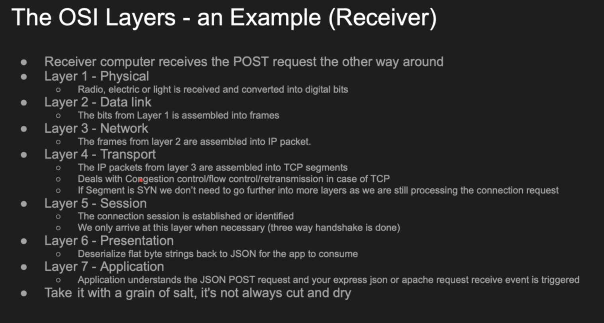
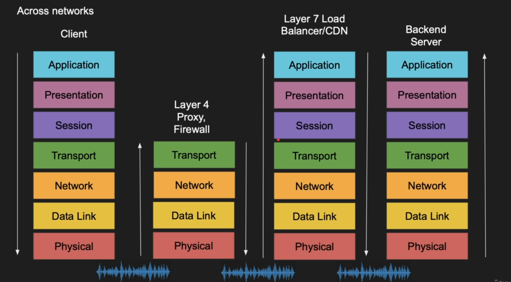

# OSI Model 

## Introduction to the OSI Model
The OSI model, developed by the International Organization for Standardization (ISO) in the late 1970s, is a conceptual framework that standardizes network communication into seven layers.
Each layer handles specific tasks, making it easier to design, troubleshoot, and maintain networks. For a beginner, it’s a roadmap to understand how data moves from one device to another, whether you’re setting up a Linux server or configuring cloud networks.

## Why the OSI Model Matters
- **Standardization:** Ensures devices and software from different vendors work together.
- **Troubleshooting:** Helps pinpoint issues (e.g., a cable problem at the Physical Layer or a routing issue at the Network Layer).
- **Learning Tool:** Breaks complex networking into manageable parts, crucial for DevOps roles.
- **Security:** Identifies where vulnerabilities exist, like encryption at the Presentation Layer.

## The Seven Layers of the OSI Model
Below is a detailed breakdown of each layer, including functions, protocols, devices, and examples.

| **Layer** | **Name**            | **Functions**                                                            | **Protocols/Examples**                                             | **Devices**                   |
|-----------|---------------------|--------------------------------------------------------------------------|--------------------------------------------------------------------|-------------------------------|
| 7         | Application Layer   | Provides network services to applications; enables user interaction.     | HTTP, FTP, SMTP, DNS, DHCP; e.g., web browsers, email clients.     | Web servers, email clients    |
| 6         | Presentation Layer  | Formats, encrypts, decrypts, and compresses data for application use.    | JPEG, MPEG, TLS/SSL, ASCII; e.g., encrypting an email.             | Encryption devices            |
| 5         | Session Layer       | Manages sessions between applications; handles synchronization.          | NetBIOS, RPC; e.g., maintaining a video call session.              | Proxy servers                 |
| 4         | Transport Layer     | Ensures reliable data delivery; manages segmentation and flow control.   | TCP, UDP; e.g., splitting a file into segments for transfer.       | Gateways, firewalls           |
| 3         | Network Layer       | Routes data between networks; uses logical addressing (IP).              | IP, ICMP, OSPF; e.g., routing packets to a website.                | Routers                       |
| 2         | Data Link Layer     | Ensures node-to-node delivery; handles framing and error detection.      | Ethernet, PPP; e.g., sending frames between a PC and router.       | Switches, bridges             |
| 1         | Physical Layer      | Transmits raw bits over physical media; manages hardware connections.    | USB, Ethernet cables; e.g., bits traveling through a Wi-Fi signal. | Hubs, repeaters, cables       |

### Layer 1: Physical Layer

- **Role:** Transmits raw bits (0s and 1s) over physical media like cables or wireless signals.
- **Functions:** Bit synchronization, bit rate control, physical topologies (e.g., star, bus).
- **Examples:** Ethernet cables, Wi-Fi signals, USB connections.
- **Devices:** Hubs, repeaters, modems.
- **Protocols:** SONET/SDH, USB.
- **Real-World Example:** When you plug an Ethernet cable into your computer, the Physical Layer handles the electrical signals sent through the cable.

### Layer 2: Data Link Layer
- **Role:** Ensures reliable data transfer between adjacent nodes in a network.
- **Functions:** Framing, physical addressing (MAC addresses), error detection (e.g., CRC).
- **Examples:** Ethernet frames sent between a computer and a switch.
- **Devices:** Switches, bridges. (Which converts the data to the destination MAc Address)
- **Protocols:** Ethernet, PPP.
- **Real-World Example:** Your computer’s network card uses a MAC address to send data to your router.

### Layer 3: Network Layer
- **Role:** Routes data between different networks using logical addressing.
- **Functions:** Routing, IP addressing, packet forwarding.
- **Examples:** Routing an email from your device to a server across the internet.
- **Devices:** Routers.
- **Protocols:** IP, ICMP, OSPF.
- **Real-World Example:** When you visit a website, the Network Layer routes packets to the website’s server using IP addresses.

### Layer 4: Transport Layer
- **Role:** Provides reliable end-to-end data delivery.
- **Functions:** Segmentation, Packet, flow control, error control.
- **Examples:** Splitting a video file into segments for streaming.
- **Devices:** Gateways, firewalls.
- **Protocols:** TCP (reliable), UDP (faster but less reliable).
- **Real-World Example:** TCP ensures all parts of a downloaded file arrive correctly.

### Layer 5: Session Layer
- **Role:** Manages communication sessions between applications.
- **Functions:** Session establishment, maintenance, termination; synchronization.
- **Examples:** Keeping a video call connected even if packets are lost.
- **Devices:** Proxy servers.
- **Protocols:** NetBIOS, RPC.
- **Real-World Example:** During a Zoom call, the Session Layer ensures the connection stays active.

### Layer 6: Presentation Layer
- **Role:** Formats and secures data for the Application Layer.
- **Functions:** Data translation (e.g., ASCII to EBCDIC), encryption, compression.
- **Examples:** Encrypting an email before sending it.
- **Devices:** Encryption devices.
- **Protocols:** TLS/SSL, JPEG, MPEG.
- **Real-World Example:** When you send a secure email, TLS encrypts the data at this layer.

### Layer 7: Application Layer
- **Role:** Provides network services directly to user applications.
- **Functions:** Resource sharing, remote file access, email services.
- **Examples:** Browsing a website or sending an email.
- **Devices:** Web servers, email clients.
- **Protocols:** HTTP, FTP, SMTP, DNS.
- **Real-World Example:** When you use Gmail, the Application Layer handles the email interface.

## Example Workaround: Sending an Email
To understand how the OSI model works in practice, let’s trace the process of sending an email:

1. **Application Layer:** You write an email in Gmail and click “Send.” Gmail uses SMTP to prepare the email for transmission.
2. **Presentation Layer:** The email is compressed and encrypted (e.g., using TLS) to secure it.
3. **Session Layer:** A session is established between your device and the Gmail server to manage the data exchange.
4. **Transport Layer:** The email is broken into TCP segments, ensuring reliable delivery with error checking.
5. **Network Layer:** Segments are encapsulated into packets with IP addresses (your device and the server).
6. **Data Link Layer:** Packets are turned into frames with MAC addresses for local delivery (e.g., to your router).
7. **Physical Layer:** Frames are converted into bits and sent over an Ethernet cable or Wi-Fi.

**Receiver’s Side:** The process reverses, starting at the Physical Layer and moving up to the Application Layer, where the recipient sees the email in their inbox.

## Practical Workaround for Learning
To solidify your understanding, try this hands-on exercise:
- **Set Up a Local Network:** Use two computers or virtual machines (e.g., with VirtualBox).
- **Install Wireshark:** Download [Wireshark](https://www.wireshark.org/) to capture network traffic.
- **Send a File:** Transfer a file between the machines using FTP (Application Layer).
- **Analyze Traffic:** Use Wireshark to observe:
    - Ethernet frames (Data Link Layer).
    - IP packets (Network Layer).
    - TCP segments (Transport Layer).
- **Note Observations:** Document which layers and protocols are involved.

This exercise helps you see the OSI model in action and prepares you for real-world DevOps tasks like network troubleshooting.

## Interview Questions and Answers
Below are common OSI model interview questions, tailored for beginners, with clear answers to help you prepare for technical interviews.

### Basic Questions
1. **What is the OSI model?**
    - It’s a seven-layer framework that explains how data moves across networks, from physical connections to applications. It helps standardize and troubleshoot networking.

2. **Name the seven layers of the OSI model.**
    - Application, Presentation, Session, Transport, Network, Data Link, Physical.

3. **What does the Physical Layer do?**
    - It transmits raw bits over physical media like cables or Wi-Fi, handling bit synchronization and hardware connections.

4. **What is the role of the Data Link Layer?**
    - It ensures reliable data transfer between adjacent devices using MAC addresses and error detection (e.g., CRC).

5. **What is the difference between TCP and UDP?**
    - TCP is reliable, connection-oriented, and used for web browsing. UDP is faster, connectionless, and used for streaming.

6. **What is encapsulation?**
    - It’s the process of adding headers to data as it moves down the OSI layers (e.g., TCP header at Transport, IP header at Network).

7. **Which devices operate at the Network Layer?**
    - Routers, which route packets between networks using IP addresses.

8. **What protocols are used at the Application Layer?**
    - HTTP, FTP, SMTP, DNS.

9. **What is a MAC address?**
    - A unique identifier for network interfaces, used at the Data Link Layer (e.g., 00:1A:2B:3C:4D:5E).

10. **How does the Transport Layer ensure reliability?**
    - It uses protocols like TCP for segmentation, flow control, and error checking.

### Advanced Questions
1. **What is the difference between flow control and error control?**
    - Flow control manages data transmission speed to avoid overwhelming the receiver. Error control detects and corrects data errors.

2. **What does a router do in the OSI model?**
    - It operates at the Network Layer, routing packets between networks using IP addresses.

3. **What is the difference between unicasting, multicasting, and broadcasting?**
    - Unicasting sends data to one device, multicasting to a group, and broadcasting to all devices on a network.

4. **What is segmentation in the OSI model?**
    - It’s the Transport Layer process of dividing data into smaller segments for reliable delivery.

5. **How does the Presentation Layer work?**
    - It formats data (e.g., converting text formats) and handles encryption and compression.

6. **What is the Session Layer’s role?**
    - It manages sessions between applications, ensuring data is exchanged in order.

7. **What is CRC, and where is it used?**
    - Cyclic Redundancy Check is an error-detection method used at the Data Link Layer.

8. **What’s the difference between half-duplex and full-duplex?**
    - Half-duplex allows two-way communication but not simultaneously (e.g., walkie-talkies). Full-duplex allows simultaneous communication (e.g., phones).

9. **What is logical addressing?**
    - It’s the use of IP addresses at the Network Layer to identify devices across networks.

10. **How does the OSI model aid troubleshooting?**
    - It helps isolate issues by layer (e.g., Physical Layer for cable issues, Network Layer for routing problems).

## Tips for Beginners
- **Use Mnemonics:** Memorize layers with “All People Seem To Need Data Processing” (top-down) or “Please Do Not Throw Sausage Pizza Away” (bottom-up).
- **Practice with Tools:** Use [Wireshark](https://www.wireshark.org/) to analyze network traffic and see layers in action.
- **Relate to Real Life:** Think of the OSI model like sending a letter: writing it (Application), packaging it (Presentation), addressing it (Network), and mailing it (Physical).
- **Prepare for Interviews:** Practice explaining each layer’s role and common protocols in simple terms.

## Conclusion
The OSI model is a cornerstone of networking knowledge, especially for a future DevOps engineer. By mastering its layers, you’ll understand how Linux and cloud networks function, troubleshoot issues effectively, and excel in technical interviews. Start with the email example and hands-on exercises to build confidence, and use the interview questions to prepare for job opportunities.

## Key Citations
- [What is OSI Model | 7 Layers Explained - GeeksforGeeks](https://www.geeksforgeeks.org/open-systems-interconnection-model-osi/)
- [Top 20 OSI Model Interview Questions and Answers (2025) - PyNet Labs](https://www.pynetlabs.com/osi-model-interview-questions-and-answers/)