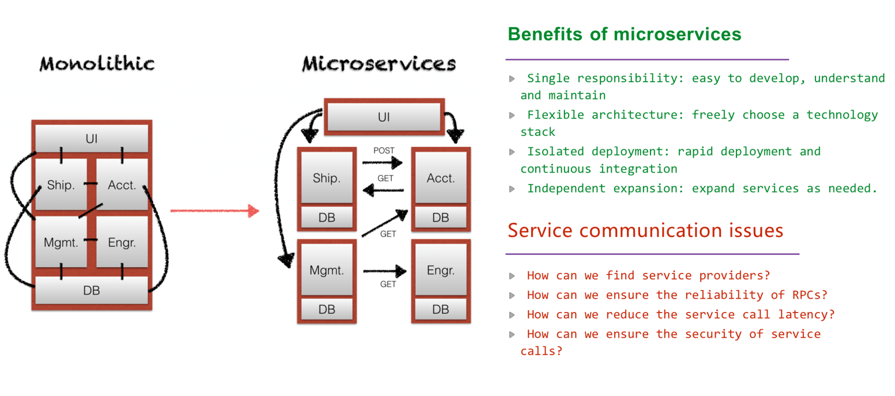

## Service Mesh
A service mesh is a dedicated infrastructure layer for handling service-to-service communication. 
It is responsible for the reliable delivery of requests through the complex topology of services that comprise a modern and cloud native application.
In practice, 
- The service mesh is typically implemented as an array of lightweight network proxies.
- Those are deployed alongside application code, without the application needing to be aware.

###  Service Mesh Key Phases

**Dedicated infrastructure layer:**
- A service mesh is not designed to solve business issues, but is a dedicated infrastructure layer (middleware).

**Service-to-service communication:**
- A service mesh is designed to handle service-to-service communication.

**Reliable delivery of requests:**
- Why is special processing necessary for service-to-service communication?
- A service mesh aims to ensure the reliable delivery of requests between services even when the network is unreliable.

**Cloud native application:**
- From the beginning, service mesh was created for modern cloud native applications and targeted future technology development trends.

**Network proxies:**
- Typically, a service mesh is implemented as an array of lightweight network proxies, without the awareness of the application.

**Deployed alongside application code:**
- The network proxies must be deployed with the application for one-to-one service.
- If communication between the application and the proxy is remote and unreliable, we have not addressed the issue.

### The Rise of Microservices

Task:
- https://github.com/anisurrahman75/microservices-demo
Deploy the above microservice demos using service mesh.

Reference:
- https://www.alibabacloud.com/blog/getting-started-with-service-mesh-origin-development-and-current-status_597241